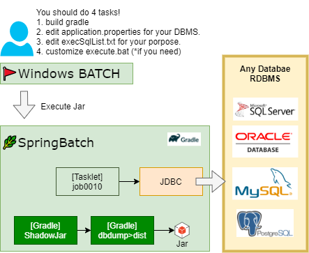

# :arrow_down:dbdump

this is batch project exporting RDBMS data made using spring batch.

## :eyes:OVERVIEW

when your system testting, this help you get db evidence easier.

please see below about Architecture:

## HOW TO USE

- clone this project
  - `git clone https://github.com/tutttuwi/dbdump.git`
- Please refer to this page to set it up. [page](./docs/setup.adoc)
- copy `dist/DBDUMP` into directory you want to put.
- edit `DBDUMP/resources/prop/application.properties`
  - for connection settings here.
- edit `DBDUMP/resources/sql/execSqlList.txt`
  - for exectute SQL statement
    - FORMAT is like `[FILENAME]:[SQL STATEMENT]`.

- execute `execute.bat`!
  - see files exported to `DBDUMP/yyyymmdd_hhmmss`

## :pushpin:SETUP

please refer this [document](./docs/index.adoc)

## :copyright:LICENCE

- MIT

## :smile:AUTHOR

- t-tsutsui <https://tutttuwi.me>
