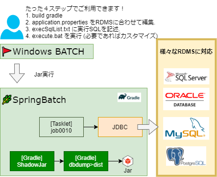

# :arrow_down:dbdump

これはSpringBatchを使ってRDBMSのデータをエクスポートするためのプロジェクトです。

## :eyes:概要

システムテストの際に、dbのエビデンスを簡単に得ることができます。

アーキテクチャーについては下記をご覧ください。

## 使い方

- プロジェクトをクローン
  - `git clone https://github.com/tutttuwi/dbdump.git`
- このページを見ながらセットアップしてください [page](./docs/setup.adoc)
- `dist/DBDUMP` をあなたの好きなディレクトリにコピーしてください
- `DBDUMP/resources/prop/application.properties` を編集してください
  - DBコネクション設定がここに記述されています。
- `DBDUMP/resources/sql/execSqlList.txt` を編集してください
  - 実行する対象のSQLステートメントがここに記述されています
    - フォーマットは `[FILENAME]:[SQL STATEMENT]` のように記述してください

- 最後に、`execute.bat`を実行してください
  - `DBDUMP/yyyymmdd_hhmmss` ディレクトリにSQLステートメントを実行した結果が出力されていることを確認してください

## :pushpin:セットアップ

こちらのドキュメントを参照してください [document](./docs/index.adoc)

## :copyright:LICENCE

- MIT

## :smile:AUTHOR

- t-tsutsui <https://tutttuwi.me>
